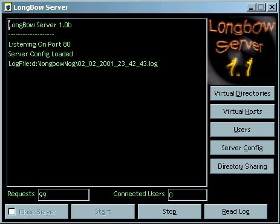



## Longbow Webserver Release 2 MAJOR UPDATE\!

### Description

A fully function webserver with heaps of features such as: scripting with database and file access, directory security and user access administration, fully logged server requests, graphical directory listing(fully customizable), http authentication, server side includes, images(some don't, dunno why? :), frames(some don't :), and with the scripting, u could make ur own online game, if u wanted to :)
 
### More Info
 
Dlls needed are in the "server" directory, run setup.bat to install these to

c:\windows\system\, base64 will be registered as it is an activex dll

             |
---                |---
**Submitted On**   |2001-03-03 23:25:38
**By**             |[Dale B\. Reidy](https://github.com/Planet-Source-Code/PSCIndex/blob/master/ByAuthor/dale-b-reidy.md)
**Level**          |Advanced
**User Rating**    |4.5 (18 globes from 4 users)
**Compatibility**  |VB 5\.0, VB 6\.0
**Category**       |[Internet/ HTML](https://github.com/Planet-Source-Code/PSCIndex/blob/master/ByCategory/internet-html__1-34.md)
**World**          |[Visual Basic](https://github.com/Planet-Source-Code/PSCIndex/blob/master/ByWorld/visual-basic.md)
**Archive File**   |[CODE\_UPLOAD15785332001\.zip](https://github.com/Planet-Source-Code/dale-b-reidy-longbow-webserver-release-2-major-update__1-21495/archive/master.zip)

